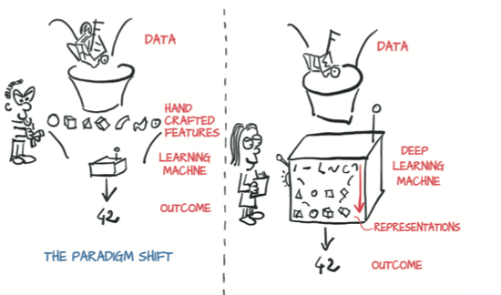

# Notes On Deep Learning With PyTorch

[TOC]

## Introducing deep learning and the PyTorch library

### What is PyTorch

Python library that enables to build deep learnig projects. The main difference is that allows deep learning models to be expressed in a pythonic way. It is based on the core data structure of ```Tensors``` wich are similar to NumPy arrays. 

### What is this book ?

Is a starting point for software engineers, data scientists, and motivated students who are fluent in Python and want to become comfortable using PyTorch to build deep learning project.

### Why PyTorch?

	1. Simplicity: Using the library generally feels familiar to developers who have used Python previously.
	2. Similarity to NumPy: PyTorch feels like NumPy, but with GPU acceleration and auto- matic computation of gradients.
	3. Expressivity: Allows the developer to implement complicated models without undue complexity being imposed by the library.
	4. Can be used in production: Has a compelling story for the transition from research and development to production.

#### The deep learning revolution

With Machine learning, a data scientist is busy defining engineering features and feeding them to a learning algorithm. The results of the task will be as good as the features he engineers. On the right side of the figure, with deep learning, the raw data is fed to an algorithm that extracts hierarchical features automatically, based on optimizing the performance of the algorithm on the task. The results will be as good as the practitioner’s ability to drive the algorithm toward its goal.



