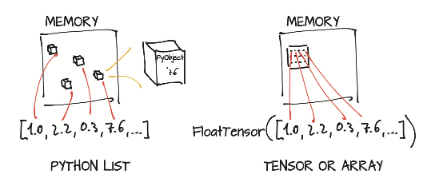

# Notes On Deep Learning With PyTorch

[TOC]

## Introducing deep learning and the PyTorch library

### What is PyTorch

Python library that enables to build deep learnig projects. The main difference is that allows deep learning models to be expressed in a pythonic way. It is based on the core data structure of ```Tensors``` wich are similar to NumPy arrays. 

### What is this book ?

Is a starting point for software engineers, data scientists, and motivated students who are fluent in Python and want to become comfortable using PyTorch to build deep learning project.

### Why PyTorch?

	1. Simplicity: Using the library generally feels familiar to developers who have used Python previously.
	2. Similarity to NumPy: PyTorch feels like NumPy, but with GPU acceleration and auto- matic computation of gradients.
	3. Expressivity: Allows the developer to implement complicated models without undue complexity being imposed by the library.
	4. Can be used in production: Has a compelling story for the transition from research and development to production.

#### The deep learning revolution

With Machine learning, a data scientist is busy defining engineering features and feeding them to a learning algorithm. The results of the task will be as good as the features he engineers. On the right side of the figure, with deep learning, the raw data is fed to an algorithm that extracts hierarchical features automatically, based on optimizing the performance of the algorithm on the task. The results will be as good as the practitioner’s ability to drive the algorithm toward its goal.


#### Immediate versus deferred execution

Immediate execution is useful because if problems arise in executing the expression, the Python interpreter, debugger, and similar tools have direct access to the Python objects involved.

```python
a = 30
b = 40
c = (a**2 + b**2) ** 0.5
```

Deferred execution means that most exceptions are be raised when the function is called, not when it’s defined.

```python
a = 30
b = 40

def pythagorean_expression(c1, c2):
	return (a**2 + b**2) ** 0.5

c = pythagorean_expression(a, b)
```

Things get tricky when specialized classes that have heavy operator overloading are used:

```python
a = InputParameterPlaceholder()
b = nputParameterPlaceholder()

def pythagorean_expression(c1, c2):
	return (a**2 + b**2) ** 0.5

c = pythagorean_expression(a, b)
```

Often in libraries that use this form of function definition, ompile the expression into a static computation graph (a graph of basic operations) that has some advantage over pure Python, such as improving performance. 

The fact that the computation graph is built in one place and used in another makes debugging more difficult. static graphs usually don’t mix well with standard Python flow control: they’re de-facto domain-specific languages implemented on top of a host language.

PyTorch that use immediate execution differ from deferred-execution frameworks, even though the underlying math is the same for both types.

The fundamental building block of a neural network is a neuron. Neurons are strung together in large numbers to form the network. The typical ecuation of a neuron is ```output = Tanh(wx + b)```

0. x is the input to a single neuron

1. w and b are the parameters or weights of the neuron and can be changed as needed.

2. To update the weights we assign error to each of the weights via backpropagation and then tweak the weights accordingly. 

3. Backpropagation requires computing the gradient of the output with respect to the weights.

4. We use automatic differentiation to compute the gradient automatically, saving us the trouble of writing the calculations by hand.


The neuron gets compiled into a symbolic graph in which each node rep- resents individual operations (second row), using placeholders for inputs and out- puts. Then the graph is evaluated numerically (third row) when concrete numbers are plugged into the placeholders.

The gradient of the output with respect to the weights is constructed sym- bolically by automatic differentiation, which traverses the graph backward and multi- plies the gradients at individual nodes (fourth row). The corresponding mathematical expression is shown in the fifth row.

One of the major competing deep learning frameworks is **TensorFlow**, which has a graph mode that uses a similar kind of deferred execution. PyTorch sports a define-by-run dynamic graph engine in which the computation graph is built node by node as the code is eagerly evaluated.


The computation is broken into individual expressions, which are greed- ily evaluated as they’re encountered. The program has no advance notion of the inter- connection between computations. The bottom half of the figure shows the behind-the- scenes construction of a dynamic computation graph for the same expression. The expression is still broken into individual operations, but here those operations are eagerly evaluated, and the graph is built incrementally. Automatic differentiation is achieved by traversing the resulting graph backward, similar to static computation graphs.

Note that this does not mean dynamic graph libraries are inherently more capable than static graph libraries, just that it’s often easier to accomplish looping or condi- tional behavior with dynamic graphs. Dynamic graphs can change during successive forward passes. Different nodes can be invoked according to conditions on the outputs of the preceding nodes, for example, without a need for such conditions to be represented in the graph itself—a dis- tinct advantage over static graph approaches.

#### The deep learning landscape

0. **Theano** (University of Montreal) : 

	* One of the first deep learning frameworks, has ceased active development.

1. **TensorFlow** (Google):

	* Consumed Keras, promoting it to a first-class API
	* Provided an immediate execution eager mode (a new define-by-run API, increasing the library’s flexibility)

2. **PyTorch** (Facebook):

	* Consumed Caffe2 for its backend
	* Replaced most of the low-level code reused from the Lua-based Torch project.
	* Added a delayed execution graph mode runtime called TorchScript

**Summary**

TensorFlow has a robust pipeline to production, an extensive industrywide community, and massive mindshare. 

PyTorch has made huge inroads with the research and teaching community, thanks to its ease of use, and has picked up momentum as researchers and graduates train students and move to industry.

### PyTorch has the batteries included

PyTorch is a library that provides multidimensional arrays, called tensors in PyTorch parlance, and an extensive library of operations on them is provided by the torch module. Both tensors and related operations can run on the CPU or GPU.


What do you need: A source of training data, an optimizer to adapt the model to the training data, and a way to get the model and data to the hardware that will be performing the calculations needed for training the model.

Utilities for data loading and handling can be found in ```torch.util.data```. The two main classes you’ll work with are ```Dataset```, which acts as the bridge between your custom data,  and a standardized PyTorch ```Tensor```. 

PyTorch also provides a deferred execution model named ```TorchScript```. Serialize a set of instruc- tions that can be invoked independently from Python. this execution mode gives PyTorch the opportunity to Just in Time (JIT) transform sequences of known operations into more efficient fused operations.

## It starts with a tensor

Deep learning consists of building a system that can transform data from one representation to another. This transformation is driven by extracting commonalities from a series of examples that demonstrate the desired mapping. The resulting system can consume broad swaths of similar inputs and produce meaningful output for those inputs. 

1. Convert input to floating point numbers.

2. Transformation of the data. Is typically learned by a deep neural network in stages. Such intermediate representations are collections of floating-point numbers that characterize the input and capture the structure in the data. Such characterization is specific to the task at hand and is learned from relevant examples.


How PyTorch handles and stores data: as input, as intermediate representation and as output? With fundamental data structure the **Tensor**. The term tensor comes bundled with the notion of spaces, reference systems, and transformations between them. Is the generalization of vectors and matrices to an arbitrary number of dimensions.

Another name for the same concept is multidimensional arrays. The dimensionality of a tensor coincides with the number of indexes used to refer to scalar values within the tensor


Compared with NumPy arrays, PyTorch tensors have a few superpowers, such as the ability to perform fast operations on graphical processing units (GPUs), to distrib- ute operations on multiple devices or machines, and to keep track of the graph of computations that created them. 

### Tensor fundamentals

Is a data structure storing collection of numbers that are accessible individually by means of an index and that can be indexed with multiple indices. Python has data structures that cover those needs, but they are ineficient for deep learning. 

	* Numbers in Python are full-fledged objects: Whereas a floating-point number might take only 32 bits to be represented on a computer, Python boxes them in a full- fledged Python object with reference counting and so on.
	* Lists in Python are meant for sequential collections of objects: No operations are defined for, say, efficiently taking the dot product of two vectors or summing vectors. Also, Python lists have no way of optimizing the layout of their content in memory, as they’re indexable collections of pointers to Python objects. Finally, Python lists are one-dimensional, and although you can create lists of lists, again, this practice is inefficient.
	* The Python interpreter is slow compared with optimized, compiled code. Performing mathematical operations on large collections of numerical data can be must faster using optimized code written in a compiled, low-level language like C.


Python lists or tuples of num- bers are collections of Python objects that are individually allocated in memory. PyTorch tensors or NumPy arrays, on the other hand, are views over (typically) contiguous memory blocks containing unboxed C numeric types, not Python objects.



```python
import torch

points = torch.tensor([1, 2, 3, 4, 5, 6, 7]) # Create a tensor out of a list
points = torch.tensor([[1, 2] , [3, 4], [5, 6]]) # Create a tensor out of a list of lists
points = torch.FloatTensor([[1, 2] , [3, 4], [5, 6]]) # Create a floating points tensor

one_tensor = points[0]
another_tensor = points[0, 1]
```

Note that what you get as the output in ```one_tensor``` and in ```another_tensor``` are tensors too. But **NO**new chunk of memory was allocated, values were copied into it, and the new memory was returned wrapped in a new tensor object, What you got back instead was a differ- ent view of the same underlying data, limited to the first row.

### Tensors and storages

Values are allocated in contiguous chunks of memory, managed by torch.Storage instances. A storage is a one-dimensional array of numerical data, such as a contiguous block of memory containing numbers of a given type, perhaps a float or int32. A PyTorch Tensor is a view over such a Storage that’s capable of indexing into that storage by using an offset and per-dimension strides.

Multiple tensors can index the same storage even if they index into the data differently. The underlying memory is allocated only once, however, so creating alternative tensor views on the data can be done quickly, regardless of the size of the data managed by the Storage instance.


```python
import torch

points = torch.tensor([[1, 2] , [3, 4], [5, 6]]) # Create a tensor out of a list of lists
print(points.storage()) # 1D array with all the sitorages
```

The layout of a storage is always one-dimensional, irrespective of the dimensionality of any tensors that may refer to it.

You’ll seldom, if ever, use storage instances directly, but understanding the relation- ship between a tensor and the underlying storage is useful for understanding the cost (or lack thereof) of certain operations later. This mental model is a good one to keep in mind when you want to write effective PyTorch code.

### Size, storage offset, and strides

To index into a storage, tensors rely on a few pieces of information that, together with their storage, unequivocally define them: size, storage offset, and stride. 

1. **size** (like shape() in NumPy): Is a tuple indicating how many elements across each dimension the tensor represents.

2. **storage offset**: Is the index in the storage that corresponds to the first element in the tensor.

3. **stride**: Is the number of elements in the storage that need to be skipped to obtain the next element along each dimension. 


```python
import torch

points = torch.tensor([[1, 2] , [3, 4], [5, 6]]) # Create a tensor out of a list of lists
second_point = points[1]

print(second_point.storage_offset())
print(second_point.size())
print(second_point.stride())
```

This indirection between Tensor and Storage leads some operations, such as transposing a tensor or extracting a subtensor, to be inexpensive, as they don’t lead to memory reallocations; instead, they consist of allocating a new tensor object with a dif- ferent value for size, storage offset, or stride.

**Changing the subtensor has a side effect on the original tensor too** As this may not always be desirable, you can clone the subtensor into a new tensor. 

```python
import torch

points = torch.tensor([[1, 2] , [3, 4], [5, 6]]) # Create a tensor out of a list of lists
second_point = points[1].clone()

second_point = 10
```

If you transpose a tensor you can see that they share storage. No new memory is allocated: transposing is obtained only by creating a new Tensor instance with different stride ordering from the original.

```python
import torch

points = torch.tensor([[1, 2] , [3, 4], [5, 6]]) # Create a tensor out of a list of lists
points_t = points.t()

id(points.storage()) == id(points_t.storage())
```


Transposing in PyTorch isn’t limited to matrices. You can transpose a multidimen- sional array by specifying the two dimensions along which transposing.

```python
import torch

points = torch.ones(3, 4, 5) # Create a tensor out of a list of lists
points_partial_t = points.transpose(0, 2)
```

A tensor whose values are laid out in the storage starting from the rightmost dimension onward. Is defined as being contiguous. Contiguous tensors are convenient because you can visit them efficiently and in order without jumping around in the storage.

```python
import torch

points = torch.ones(3, 4, 5) # Create a tensor out of a list of lists
points_partial_t = points.transpose(0, 2)

print(points.is_contiguous()) # This is True
print(points_partial_t.is_contiguous()) # This is False
```

You can obtain a new contiguous tensor from a noncontiguous one by using the con- tiguous method. The content of the tensor stays the same, but the stride changes, as does the storage:

```python
import torch

points = torch.ones(3, 4, 5) # Create a tensor out of a list of lists
points_partial_t = points.transpose(0, 2)
points_t_cont = points_t.contiguous()

print(points.is_contiguous()) # This is False
print(points_partial_t.is_contiguous()) # This is True 
```

Notice that the storage has been reshuffled for elements to be laid out row by row in the new storage. The stride has been changed to reflect the new layout.

### Numeric types

I should keep this tomorrow
