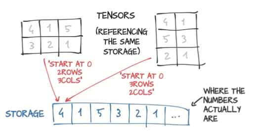
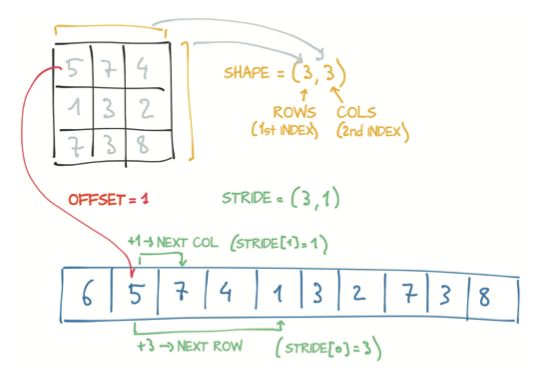

# Notes On Deep Learning With PyTorch

[TOC]

## Introducing deep learning and the PyTorch library

### What is PyTorch

Python library that enables to build deep learnig projects. The main difference is that allows deep learning models to be expressed in a pythonic way. It is based on the core data structure of ```Tensors``` wich are similar to NumPy arrays. 

### What is this book ?

Is a starting point for software engineers, data scientists, and motivated students who are fluent in Python and want to become comfortable using PyTorch to build deep learning project.

### Why PyTorch?

	1. Simplicity: Using the library generally feels familiar to developers who have used Python previously.
	2. Similarity to NumPy: PyTorch feels like NumPy, but with GPU acceleration and auto- matic computation of gradients.
	3. Expressivity: Allows the developer to implement complicated models without undue complexity being imposed by the library.
	4. Can be used in production: Has a compelling story for the transition from research and development to production.

#### The deep learning revolution

With Machine learning, a data scientist is busy defining engineering features and feeding them to a learning algorithm. The results of the task will be as good as the features he engineers. On the right side of the figure, with deep learning, the raw data is fed to an algorithm that extracts hierarchical features automatically, based on optimizing the performance of the algorithm on the task. The results will be as good as the practitioner’s ability to drive the algorithm toward its goal.


#### Immediate versus deferred execution

Immediate execution is useful because if problems arise in executing the expression, the Python interpreter, debugger, and similar tools have direct access to the Python objects involved.

```python
a = 30
b = 40
c = (a**2 + b**2) ** 0.5
```

Deferred execution means that most exceptions are be raised when the function is called, not when it’s defined.

```python
a = 30
b = 40

def pythagorean_expression(c1, c2):
	return (a**2 + b**2) ** 0.5

c = pythagorean_expression(a, b)
```

Things get tricky when specialized classes that have heavy operator overloading are used:

```python
a = InputParameterPlaceholder()
b = nputParameterPlaceholder()

def pythagorean_expression(c1, c2):
	return (a**2 + b**2) ** 0.5

c = pythagorean_expression(a, b)
```

Often in libraries that use this form of function definition, ompile the expression into a static computation graph (a graph of basic operations) that has some advantage over pure Python, such as improving performance. 

The fact that the computation graph is built in one place and used in another makes debugging more difficult. static graphs usually don’t mix well with standard Python flow control: they’re de-facto domain-specific languages implemented on top of a host language.

PyTorch that use immediate execution differ from deferred-execution frameworks, even though the underlying math is the same for both types.

The fundamental building block of a neural network is a neuron. Neurons are strung together in large numbers to form the network. The typical ecuation of a neuron is ```output = Tanh(wx + b)```

0. x is the input to a single neuron

1. w and b are the parameters or weights of the neuron and can be changed as needed.

2. To update the weights we assign error to each of the weights via backpropagation and then tweak the weights accordingly. 

3. Backpropagation requires computing the gradient of the output with respect to the weights.

4. We use automatic differentiation to compute the gradient automatically, saving us the trouble of writing the calculations by hand.


The neuron gets compiled into a symbolic graph in which each node rep- resents individual operations (second row), using placeholders for inputs and out- puts. Then the graph is evaluated numerically (third row) when concrete numbers are plugged into the placeholders.

The gradient of the output with respect to the weights is constructed sym- bolically by automatic differentiation, which traverses the graph backward and multi- plies the gradients at individual nodes (fourth row). The corresponding mathematical expression is shown in the fifth row.

One of the major competing deep learning frameworks is **TensorFlow**, which has a graph mode that uses a similar kind of deferred execution. PyTorch sports a define-by-run dynamic graph engine in which the computation graph is built node by node as the code is eagerly evaluated.


The computation is broken into individual expressions, which are greed- ily evaluated as they’re encountered. The program has no advance notion of the inter- connection between computations. The bottom half of the figure shows the behind-the- scenes construction of a dynamic computation graph for the same expression. The expression is still broken into individual operations, but here those operations are eagerly evaluated, and the graph is built incrementally. Automatic differentiation is achieved by traversing the resulting graph backward, similar to static computation graphs.

Note that this does not mean dynamic graph libraries are inherently more capable than static graph libraries, just that it’s often easier to accomplish looping or condi- tional behavior with dynamic graphs. Dynamic graphs can change during successive forward passes. Different nodes can be invoked according to conditions on the outputs of the preceding nodes, for example, without a need for such conditions to be represented in the graph itself—a dis- tinct advantage over static graph approaches.

#### The deep learning landscape

0. **Theano** (University of Montreal) : 

	* One of the first deep learning frameworks, has ceased active development.

1. **TensorFlow** (Google):

	* Consumed Keras, promoting it to a first-class API
	* Provided an immediate execution eager mode (a new define-by-run API, increasing the library’s flexibility)

2. **PyTorch** (Facebook):

	* Consumed Caffe2 for its backend
	* Replaced most of the low-level code reused from the Lua-based Torch project.
	* Added a delayed execution graph mode runtime called TorchScript

**Summary**

TensorFlow has a robust pipeline to production, an extensive industrywide community, and massive mindshare. 

PyTorch has made huge inroads with the research and teaching community, thanks to its ease of use, and has picked up momentum as researchers and graduates train students and move to industry.

### PyTorch has the batteries included

PyTorch is a library that provides multidimensional arrays, called tensors in PyTorch parlance, and an extensive library of operations on them is provided by the torch module. Both tensors and related operations can run on the CPU or GPU.


What do you need: A source of training data, an optimizer to adapt the model to the training data, and a way to get the model and data to the hardware that will be performing the calculations needed for training the model.

Utilities for data loading and handling can be found in ```torch.util.data```. The two main classes you’ll work with are ```Dataset```, which acts as the bridge between your custom data,  and a standardized PyTorch ```Tensor```. 

PyTorch also provides a deferred execution model named ```TorchScript```. Serialize a set of instruc- tions that can be invoked independently from Python. this execution mode gives PyTorch the opportunity to Just in Time (JIT) transform sequences of known operations into more efficient fused operations.

## It starts with a tensor

Deep learning consists of building a system that can transform data from one representation to another. This transformation is driven by extracting commonalities from a series of examples that demonstrate the desired mapping. The resulting system can consume broad swaths of similar inputs and produce meaningful output for those inputs. 

1. Convert input to floating point numbers.

2. Transformation of the data. Is typically learned by a deep neural network in stages. Such intermediate representations are collections of floating-point numbers that characterize the input and capture the structure in the data. Such characterization is specific to the task at hand and is learned from relevant examples.


How PyTorch handles and stores data: as input, as intermediate representation and as output? With fundamental data structure the **Tensor**. The term tensor comes bundled with the notion of spaces, reference systems, and transformations between them. Is the generalization of vectors and matrices to an arbitrary number of dimensions.

Another name for the same concept is multidimensional arrays. The dimensionality of a tensor coincides with the number of indexes used to refer to scalar values within the tensor


Compared with NumPy arrays, PyTorch tensors have a few superpowers, such as the ability to perform fast operations on graphical processing units (GPUs), to distrib- ute operations on multiple devices or machines, and to keep track of the graph of computations that created them. 

### Tensor fundamentals

Is a data structure storing collection of numbers that are accessible individually by means of an index and that can be indexed with multiple indices. Python has data structures that cover those needs, but they are ineficient for deep learning. 

	* Numbers in Python are full-fledged objects: Whereas a floating-point number might take only 32 bits to be represented on a computer, Python boxes them in a full- fledged Python object with reference counting and so on.
	* Lists in Python are meant for sequential collections of objects: No operations are defined for, say, efficiently taking the dot product of two vectors or summing vectors. Also, Python lists have no way of optimizing the layout of their content in memory, as they’re indexable collections of pointers to Python objects. Finally, Python lists are one-dimensional, and although you can create lists of lists, again, this practice is inefficient.
	* The Python interpreter is slow compared with optimized, compiled code. Performing mathematical operations on large collections of numerical data can be must faster using optimized code written in a compiled, low-level language like C.


Python lists or tuples of num- bers are collections of Python objects that are individually allocated in memory. PyTorch tensors or NumPy arrays, on the other hand, are views over (typically) contiguous memory blocks containing unboxed C numeric types, not Python objects.


```python
import torch

points = torch.tensor([1, 2, 3, 4, 5, 6, 7]) # Create a tensor out of a list
points = torch.tensor([[1, 2] , [3, 4], [5, 6]]) # Create a tensor out of a list of lists
points = torch.FloatTensor([[1, 2] , [3, 4], [5, 6]]) # Create a floating points tensor

one_tensor = points[0]
another_tensor = points[0, 1]
```

Note that what you get as the output in ```one_tensor``` and in ```another_tensor``` are tensors too. But **NO**new chunk of memory was allocated, values were copied into it, and the new memory was returned wrapped in a new tensor object, What you got back instead was a differ- ent view of the same underlying data, limited to the first row.

### Tensors and storages

Values are allocated in contiguous chunks of memory, managed by torch.Storage instances. A storage is a one-dimensional array of numerical data, such as a contiguous block of memory containing numbers of a given type, perhaps a float or int32. A PyTorch Tensor is a view over such a Storage that’s capable of indexing into that storage by using an offset and per-dimension strides.

Multiple tensors can index the same storage even if they index into the data differently. The underlying memory is allocated only once, however, so creating alternative tensor views on the data can be done quickly, regardless of the size of the data managed by the Storage instance.



```python
import torch

points = torch.tensor([[1, 2] , [3, 4], [5, 6]]) # Create a tensor out of a list of lists
print(points.storage()) # 1D array with all the sitorages
```

The layout of a storage is always one-dimensional, irrespective of the dimensionality of any tensors that may refer to it.

You’ll seldom, if ever, use storage instances directly, but understanding the relation- ship between a tensor and the underlying storage is useful for understanding the cost (or lack thereof) of certain operations later. This mental model is a good one to keep in mind when you want to write effective PyTorch code.

### Size, storage offset, and strides

To index into a storage, tensors rely on a few pieces of information that, together with their storage, unequivocally define them: size, storage offset, and stride. 

1. **size** (like shape() in NumPy): Is a tuple indicating how many elements across each dimension the tensor represents.

2. **storage offset**: Is the index in the storage that corresponds to the first element in the tensor.

3. **stride**: Is the number of elements in the storage that need to be skipped to obtain the next element along each dimension. 



```python
import torch

points = torch.tensor([[1, 2] , [3, 4], [5, 6]]) # Create a tensor out of a list of lists
second_point = points[1]

print(second_point.storage_offset())
print(second_point.size())
print(second_point.stride())
```

This indirection between Tensor and Storage leads some operations, such as transposing a tensor or extracting a subtensor, to be inexpensive, as they don’t lead to memory reallocations; instead, they consist of allocating a new tensor object with a dif- ferent value for size, storage offset, or stride.

**Changing the subtensor has a side effect on the original tensor too** As this may not always be desirable, you can clone the subtensor into a new tensor. 

```python
import torch

points = torch.tensor([[1, 2] , [3, 4], [5, 6]]) # Create a tensor out of a list of lists
second_point = points[1].clone()

second_point = 10
```

If you transpose a tensor you can see that they share storage. No new memory is allocated: transposing is obtained only by creating a new Tensor instance with different stride ordering from the original.

```python
import torch

points = torch.tensor([[1, 2] , [3, 4], [5, 6]]) # Create a tensor out of a list of lists
points_t = points.t()

id(points.storage()) == id(points_t.storage())
```


Transposing in PyTorch isn’t limited to matrices. You can transpose a multidimen- sional array by specifying the two dimensions along which transposing.

```python
import torch

points = torch.ones(3, 4, 5) # Create a tensor out of a list of lists
points_partial_t = points.transpose(0, 2)
```

A tensor whose values are laid out in the storage starting from the rightmost dimension onward. Is defined as being contiguous. Contiguous tensors are convenient because you can visit them efficiently and in order without jumping around in the storage.

```python
import torch

points = torch.ones(3, 4, 5)
points_partial_t = points.transpose(0, 2)

print(points.is_contiguous()) # This is True
print(points_partial_t.is_contiguous()) # This is False
```

You can obtain a new contiguous tensor from a noncontiguous one by using the con- tiguous method. The content of the tensor stays the same, but the stride changes, as does the storage:

```python
import torch

points = torch.ones(3, 4, 5) 
points_partial_t = points.transpose(0, 2)
points_t_cont = points_t.contiguous()

print(points.is_contiguous()) # This is False
print(points_partial_t.is_contiguous()) # This is True 
```

Notice that the storage has been reshuffled for elements to be laid out row by row in the new storage. The stride has been changed to reflect the new layout.

### Numeric types

The data type specifies the possible values that the tensor can hold and the number of bytes per value. This is the list of possible values:

	* 􏰀 torch.float32 or torch.float: 32-bit floating-point
	*  torch.float64 or torch.double: 64-bit double-precision floating-point
	*  torch.float16 or torch.half: 16-bit half-precision floating-point
	*  torch.int8: Signed 8-bit integers
	*  torch.uint8: Unsigned 8-bit integers
	*  torch.int16 or torch.short: Signed 16-bit integers
	*  torch.int32 or torch.int: Signed 32-bit integers
	*  torch.int64 or torch.long: Signed 64-bit integers

Each of torch.float, torch.double, and so on has a corresponding concrete class of ```torch.FloatTensor``` or  ```torch.DoubleTensor```. The class for torch.int8 is ```torch.CharTensor```, and the class for torch.uint8 is ```torch.ByteTensor```. torch.Tensor is an alias for ```torch.FloatTensor```. The default data type is 32-bit floating-point. This code example shows how to check de data type: 

```python
import torch

points = torch.ones(3, 4, 5) 
print(points.dtype) # prints the type of the data stored inside a tensor

# One way to define the types (on the creation of the tesor)
double_points = torch.ones(10, 2, dtype=torch.double)
short_points = torch.tensor([[1, 2], [3, 4]], dtype=torch.short)

# Another way to define the types, afer they are created

double_points = torch.zeros(10, 2).double()
short_points = torch.ones(10, 2).short()

# Is more convinient to use the to method when transforming

double_points = torch.zeros(10, 2).to(torch.double)
short_points = torch.ones(10, 2).to(dtype=torch.short)
```

### Indexing Tensors

The indexing method is the same than in NumPy along all the dimensions of the tensor. 


In addition to using ranges, PyTorch features a powerful form of indexing called *advanced indexing*.

### NumPy interoperability

PyTorch tensors can be converted to NumPy arrays and vice versa efficiently. By doing so, you can leverage the huge swath of functionality in the wider Python ecosystem that has built up around the NumPy array type. 
When transformin a tensor to an array, the returned array shares an underlying buffer with the tensor storage. As a result, the numpy method can be executed effectively at essentially no cost as long as the data sits in CPU RAM, and modifying the NumPy array leads to a change in the originating tensor.

```python
import torch

# From tensor to numpy 
points = torch.ones(3, 4)
points_np = points.numpy()

# From numpy to tensor
points = torch.from_numpy(points_np)
```

### Serializing tensors

If you want to save data in a certain point pytorch uses ```pickle```. 

```python
torch.save(points, '../data/p1ch3/ourpoints.t')

with open('../data/p1ch3/ourpoints.t','wb') as f:
	torch.save(points, f)

points = torch.load('../data/p1ch3/ourpoints.t')
```

For those cases when you need to, however, you can use the HDF5 format and library. HDF5 is a portable, widely supported format for representings erialized multidimensional arrays, organized in a nested key-value dictionary. 

```python
import h5py

f = h5py.File('../data/p1ch3/ourpoints.hdf5', 'w')
dset = f.create_dataset('coords', data=points.numpy())
f.close()

f = h5py.File('../data/p1ch3/ourpoints.hdf5', 'r')
dset = f['coords']
last_points = dset[1:]
```
You can pass the returned object to the torch.from_numpy function to obtain a tensor directly. Note that in this case, the data is copied over to the tensor’s storage. 

```python
last_points = torch.from_numpy(dset[1:])
f.close()
```
### Moving Tensors to GPU

Every Torch tensor can be transferred to a GPUs to perform fast, massively parallel computations. PyTorch tensor has a notion of ```device```, which is where on the computer the tensor data is being placed. 

```python
points_gpu = torch.tensor([[1.0, 4.0], [2.0, 1.0], [3.0, 4.0]], device='cuda')
```
You could instead copy a tensor created on the CPU to the GPU by using the to method:

```python
points_gpu = points.to(device='cuda')
points_gpu = points.to(device='cuda:0') # In case your machine has more than one GPU

points = 2 * points # CPU multiplication
points_gpu = 2 * points.to(device='cuda') # GPU multiplication
points_cpu = points_gpu.to(device='cpu') # Resuts of multiplication back from GPU to CPU
```

This is what happens in the code : 

1) The points tensor was copied to the GPU.
2) A new tensor was allocated on the GPU and used to store the result of the multiplication.
3) A handle to that GPU tensor was returned.
4) The tensor is back to CPU

### The tensor API

The oficial documentation link is [API link](http://pytorch.org/docs.) The vast majority of operations on and between tensors are available under the torch module and can also be called as methods of a tensor object. No difference exists between the two forms, which can be used interchangeably.

```python
# Way 1
a = torch.ones(3, 2)
a_t = torch.transpose(a, 0, 1)

# Way 2
a = torch.ones(3, 2)
a_t = a.transpose(0, 1)
```
In the documentation tensor operations are divided into groups:

1) *Creation ops*: Functions for constructing a tensor, such as ones and from_numpy
2) *Indexing, slicing, joining, and mutating ops* : Functions for changing the shape stride, or content of a tensor, such as transpose.
3) *Math ops*: Functions for manipulating the content of the tensor through computations:

	*Pointwise ops*: Functions for obtaining a new tensor by applying a function to
	each element independently, such as abs and cos
	*Reduction ops*: Functions for computing aggregate values by iterating through
	tensors, such as mean, std, and norm
	*Comparison ops*: Functions for evaluating numerical predicates over tensors, such as equal and max
	*Spectral ops*: Functions for transforming in and operating in the frequency domain, such as stft and hamming_window
	*Other ops*: Special functions operating on vectors, such as cross, or matrices, such as trace
	*BLAS and LAPACK ops*: Functions that follow the BLAS (Basic Linear Alge- bra Subprograms) specification for scalar, vector-vector, matrix-vector, and matrix-matrix operations
4) *Random sampling ops*: Functions for generating values by drawing randomly from probability distributions, such as randn and normal
5) *Serialization ops*: Functions for saving and loading tensors, such as load and save
6) *Parallelism ops*: Functions for controlling the number of threads for parallel CPU execution, such as set_num_threads

## Real-world data representation with tensors

### Tabular data

This data is a table containing one row per sample (or record), in which columns contain one piece of information about the sample. 

At first, assume that there’s no meaning in the order in which samples appear in the table. Such a table is a collection of independent samples, unlike a time-series, in which samples are related by a time dimension.

Columns may contain numerical values, but tabular data typically isn’t homogeneous; different columns don’t have the same type.

PyTorch tensors, on the other hand, are homogeneous. Other data science packages, such as Pandas, have the concept of the data frame, an object representing a data set with named, heterogenous columns. PyTorch is encoded as a number. Numeric encoding is deliberate, because neural networks are mathematical entities that take real numbers as inputs and produce real numbers as output through successive application of matrix multiplications and nonlinear functions. So yo need to **encode heterogeneous real-world data in a tensor**. 

Continous, ordinal, and categorical values:

	*continuous values*: These values are the most intuitive when represented as numbers, they’re strictly ordered, and a difference between various values has a strict meaning. If you’re counting or measuring something with units, the value probably is a continuous value.

	*ordinal values*: The strict ordering of continuous values remains, but the fixed relationship between values no longer applies. (An example is to small, medium or large drink) It’s important to remember that you can’t do math on the values beyond ordering them.

	*categorical values*: have neither ordering nor numerical meaning. These values are often enumerations of possibilities, assigned arbitrary numbers (An example water to 1, coffee to 2, soda to 3, and milk to 4). Has no real logic; you simply need distinct values to differentiate them. (although assigning values in the range 0..N-1 will have advantages, check one-hot encoding)

Here is an example of how to work with a tabular dataset [The wine dataset](./data/winequality-white.csv), this is the columns it has, all of them numeric:

```python
wine_datatset_columns = ['fixed acidity', 'volatile acidity', 'citric acid', 'residual sugar', 'chlorides',
'free sulfur dioxide', 'total sulfur dioxide', 'density', 'pH', 'sulphates', 'alcohol', 'quality']
```

You could treat the **quality** as a continuous variable, keep it as a real number, and perform a regression task, or treat it as a label and try to guess such label from the chemi- cal analysis in a classification task. In both methods, you typically remove the score from the tensor of input data and keep it in a separate tensor, so that you can use the score as the ground truth without it being input to your model.

If you want to transform the target tensor in a tensor of labels, you have two options: One option is to treat a label as an integer vector of **quality**. The other approach is to build a *one-hot encoding* of the scores. encode each of the ten scores in a vector of ten elements, with all elements set to zero but one, at a different index for each score.

The two approaches have marked differences. Keeping wine-quality scores in an integer vector of scores induces an ordering of the scores (may be appropriate in this case because a score of 1 is lower than a score of 4). It also induces some distance between scores (The distance between 1 and 3 is the same as the distance between 2 and 4, for example). If, on the other hand, scores are purely qualitative, such as color, one-hot encoding is a much better fit, as no implied ordering or distance is involved. One-hot encoding is appropriate for quantitative scores when fractional values between integer scores make no sense for the application. 

```python
target_onehot = torch.zeros(target.shape[0], 10)
target_onehot.scatter_(1, target.unsqueeze(1), 1.0)
```

*scatter_* notice that its name ends with an underscore. This convention in PyTorch indicates that the method won’t return a new ten- sor but modify the tensor in place. The arguments are:

1) The dimension along which the following two arguments are specified
2) A column tensor indicating the indices of the elements to scatter
3) A tensor containing the elements to scatter or a single scalar to scatter 

You can **normalize** the data by subtracting the mean and dividing by the standard deviation, which helps with the learning process. 

You can take a general idea of the data, by separating by target labels and calculation the mean of each column of the X tensor. 

```python
bad_data = data[torch.le(target, 3)] # less
mid_data = data[torch.gt(target, 3) & torch.lt(target, 7)]
good_data = data[torch.ge(target, 7)] # greater

bad_mean = torch.mean(bad_data, dim=0)
mid_mean = torch.mean(mid_data, dim=0)
good_mean = torch.mean(good_data, dim=0)

for i, args in enumerate(zip(col_list, bad_mean, mid_mean, good_mean)):
print('{:2} {:20} {:6.2f} {:6.2f} {:6.2f}'.format(i, *args))
```

### Time Series

Is a tabular data structure in which samples are related by a time dimension. The existence of an ordering, however, gives you the opportunity to exploit causal relationships across time. In this case the exmple dataset is [bike dataset](./data/hour-fixed.csv), you can see the description below.

```python
instant # index of record
day # day of month
season # season (1: spring, 2: summer, 3: fall, 4: winter)
yr # year (0: 2011, 1: 2012)
mnth # month (1 to 12)
hr # hour(0to23)
holiday # holiday status
weekday # day of the week
workingday # working day status
weathersit # weather situation (1: clear, 2:mist, 3: light rain/snow, 4: heavy rain/snow)
temp # temperature in C
atemp # perceived temperature in C
hum # humidity
windspeed # windspeed
casual # number of causal users
registered # number of registered users
cnt # count of rental bikes
```

This neural network model needs to see sequences of values for each quantity, such as ride count, time of day, temperature, and weather conditions, so N parallel sequences of size C. C stands for channel, in neural network parlance, and is the same as column for 1D data like you have here. The N dimension represents the time axis here, one entry per hour.

You may want to break up the 2-year data set in wider observation periods, such as days. This way, you’ll have N (for number of samples) collections of C sequences of length L. In other words, your time-series data set is a tensor of dimension 3 and shape N x C x L. The C remains your 17 channels, and L would be 24, one per hour of the day.

```python
bikes_numpy = np.loadtxt('../hour-fixed.csv')
bikes = torch.from_numpy(bikes_numpy)

bikes.shape # torch.Size([17520, 17])
bikes.stride() # (17, 1)

daily_bikes = bikes.view(-1, 24, bikes.shape[1])
daily_bikes.shape # torch.Size([730, 24, 17])
daily_bikes.stride() # (408, 17, 1)
```

*view*: changes the way that the tensor looks at the same data as contained in storage. *view* on a tensor returns a new tensor that changes the number of dimen sions and the striding information without changing the storage. Rearrange your tensor at zero cost because no data is copied at all. Your call to view requires you to provide the new shape for the returned tensor. 

We mentioned earlier that the weather-situation variable is ordinal. In fact, it has 4 lev- els: 1 for the best weather and 4 for the worst. You can create one-hot encoded vector and concatenate the columns with the data set. 

```python
first_day = bikes[:24].long()
weather_onehot = torch.zeros(first_day.shape[0], 4)
print(first_day[:,9]) # [1, 1, 1, 1, 1, 2, 1, 1, 1, 1, 1, 1, 1, 2, 2, 2, 2, 2, 3, 3, 2, 2, 2, 2])
```

Then scatter ones into our matrix according to the corresponding level at each row. Remember the use of unsqueeze to add a singleton dimension earlier.

```python
weather_onehot.scatter_(dim=1,
						index=first_day[:,9].unsqueeze(1) - 1, # you are decrasinv values by 1because the weather situation ranges from 1 to 4, whereas indices are 0-based
						value=1.0)
```

concatenate your matrix to your original data set, using the cat function.

```python
torch.cat((bikes[:24], weather_onehot), 1)[:1]
```

you prescribed your original bikes data set and your one-hot encoded weather- situation matrix to be concatenated along the column dimension (such as 1). You could have done the same thing with the reshaped daily_bikes tensor. Remember that it’s shaped (B, C, L), where L = 24.

```python 

daily_weather_onehot = torch.zeros(daily_bikes.shape[0], 4, daily_bikes.shape[2])
print(daily_weather_onehot.shape) # torch.Size([730, 4, 24])
"""
Then scatter the one-hot encoding into the tensor in the C dimension. Because opera- tion is performed in place, only the content of the tensor changes
"""
daily_weather_onehot.scatter_(1, daily_bikes[:,9,:].long().unsqueeze(1) - 1, 1.0)
print(daily_weather_onehot.shape) # torch.Size([730, 4, 24])

"""Concatenate along the C dimension:"""
daily_bikes = torch.cat((daily_bikes, daily_weather_onehot), dim=1)
```
Some of the possibilities for rescaling variables:

```python
""" You can map their range to [0.0, 1.0]"""
temp = daily_bikes[:, 10, :]
temp_min = torch.min(temp)
temp_max = torch.max(temp)
daily_bikes[:, 10, :] = (daily_bikes[:, 10, :] - temp_min) / (temp_max - temp_min)
""" Standarization: the variable has zero mean and unitary standard deviation. If the variable were drawn from a Gaussian distribution, 68 percent of the samples would sit in the [-1.0, 1.0] interval """
temp = daily_bikes[:, 10, :]
daily_bikes[:, 10, :] = (daily_bikes[:, 10, :] - torch.mean(temp)) / torch.std(temp)
```

### Text

